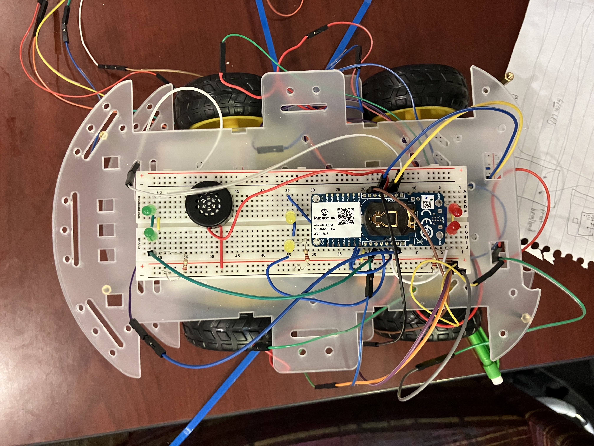
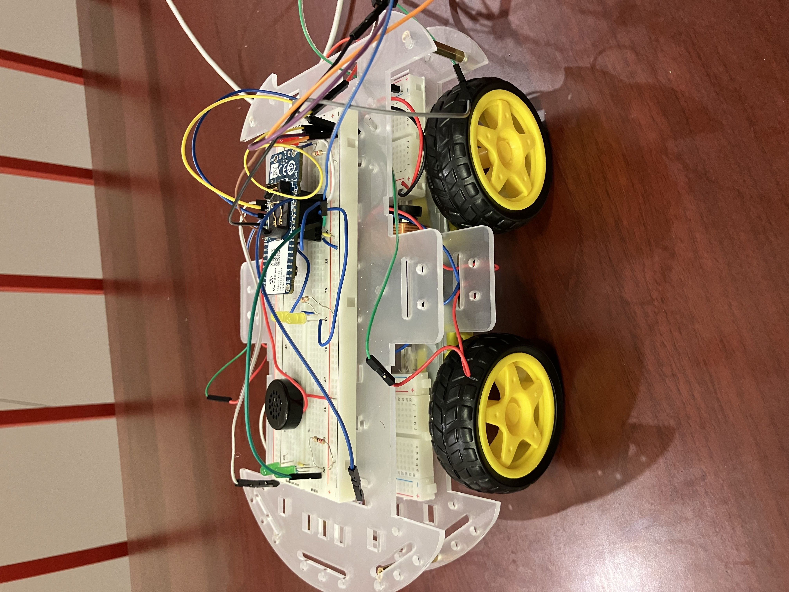
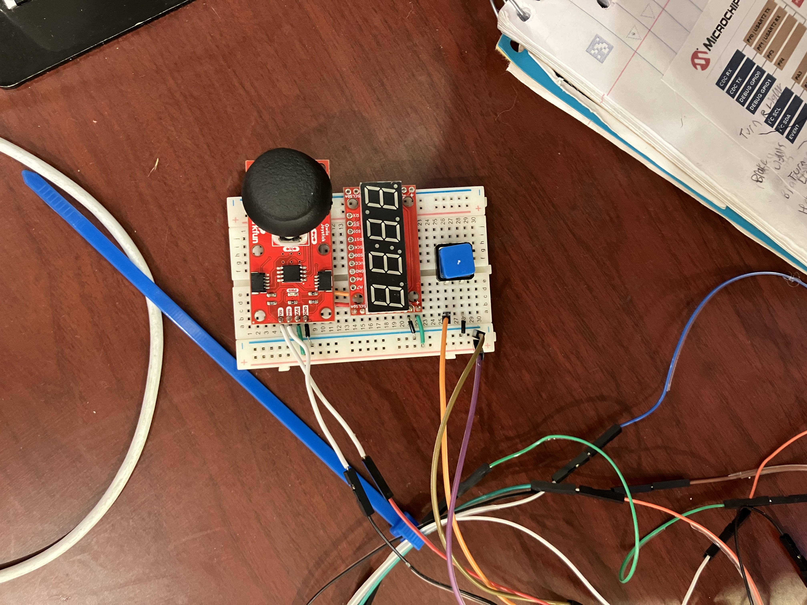
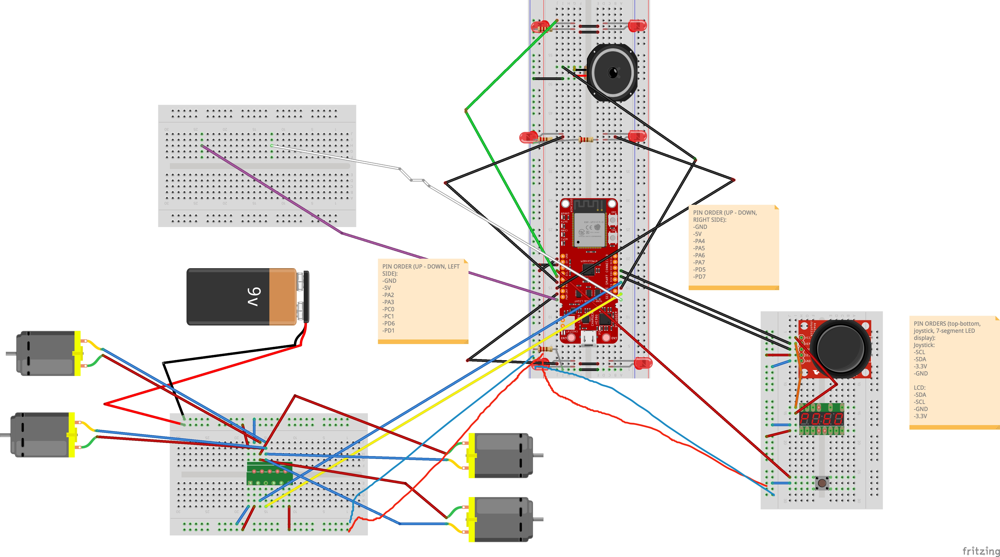

# RC Car
## Thomas Knickerbocker
### Built in MPLAB X IDE v6.15

## Overview:
- This project is a simple RC car. It is composed of an AVR-BLE development board set into a breadboard with lights, speakers, and motor control. There is a controller wired into the board that communicates to it via I2C, and has an LCD display showing the degree to which the user has moved the joystick in the forward/backward direction (from -100 to 100). Pushing down on the joystick activates the horn, and the motor direction can be easily controlled by writing a 0/1/2 to one of the car's UUID characteristics via the LightBlue App.
- The components used include one AVR-BLE development board containing an ATMega3208 microcontroller, six LEDs (2 red, 2 yellow, 2 green), one small speaker, 3 resistors, a button, a 7-segment LCD display, a joystick, four motors, four wheels, two flat plates to attach parts to, a 9v battery, and an h-bridge to allow for directional motor control and utilization of the 9v battery with PWM. The LEDs are all either connected directly to a pin on the board or connected to another LED which is connected to a pin on the board. Both the joystick and the LCD display are connected via I2C (SDA & SCL lines) to pins on the board, and the h-bridge (in addition to receiving power from the board) is connected to two pins: one indicating direction and the other being a PWM pin from the board. The speaker is connected to a PWM pin from the board as well, and the battery is connected to the power supply on the opposite side of the h-bridge as the controller’s inputs.

## Files: 
- newxc8_header: contains macros including pin#s for peripherals
- car: Contains up PWM, light, and motor control for the vehicle
- I2C: Sets up & communicates via I2C with joystick & LCD display
- rtc: sets up periodic interrupts
- printing: print statements that output via putty & xquartz when the project is run (utilizes USART2)

## Design Pictures:

**Rudimentary Board Design:**

## Parts List:

| Part Model name | Manufacturer | PowerReq | Vendor | Link | Quantity | Price (circa May 2024) | Notes |
|-----------------|--------------|----------|--------|------|----------|------------------------|-------|
| AVR-BLE DEVELOPMENT BOARD | Microchip | 3.3v | Microchip | [Link](https://www.microchip.com/en-us/development-tool/dt100111) | 1 | $45 | Completely Replacable |
| 110090263 | Seeed Technology Co., Ltd | 3.3v-12v | Digikey | [Link](https://www.digikey.com/en/products/detail/seeed-technology-co-ltd/110090263/10290284) | 1 | $7.68 | Can always 3D print an encasing on top of this |
| FIT0096 | DFRobot | 5V | Digikey | [Link](https://www.digikey.com/en/products/detail/dfrobot/FIT0096/7597069) | 2 | $5.80 | Just a breadboard. Second one not necessary, only recommended. |
| SparkFun Qwiic Joystick | SparkFun | 3.3v | SparkFun | [Link](https://www.sparkfun.com/products/15168) | 1 | $11.50 | Overpriced. Can be replaced w/ buttons or BLE |
| PART 4 DIGIT 7 SEGMENT DISPLAY | Gearbox Labs | 3.3v | Digikey | [Link](https://www.digikey.com/en/products/detail/gearbox-labs/PART-4-DIGIT-7-SEGMENT-DISPLAY/16161106) | 1 | $1.50 | Great part, great deal |
| DRV8835 Dual Motor Driver Carrier | Polulu | 0-11v | Polulu | [Link](https://www.pololu.com/product/2135) | 2 | ~$10.00 |  |
| Through-Hole Speaker | Digikey | Max 0.5W | - | [Link](https://www.sparkfun.com/products/20660) | 1 | $2.95 |  |
| Minidodoca arduino Power Supply 3.3V 5V MB102 Solderless Breadboard Power Supply Module with 9V Battery Clip +4pcs Alligator Clip Test Lead+25pcs 5 Colors LED+12pcs 0.22-470uf capacitors+ Dupont 3pcs Power Supply Module kit | Minidodoca | 5v | Amazon | [Link](https://shorturl.at/lqKW8) | 1 | $9.99 | Overkill; All we’re really looking for here is a power supply, cables, and some LEDs |

## Potential Future Extensions:
- Integrate wifi to make the device an IoT log via an esp32 peripheral 
- Add a MOSFET to the small breadboard with unused directional wires plugged into it to allow for steering control
- Alternatively, the speaker can be hooked up to the existing h-bridge to enable the production of a louder sound